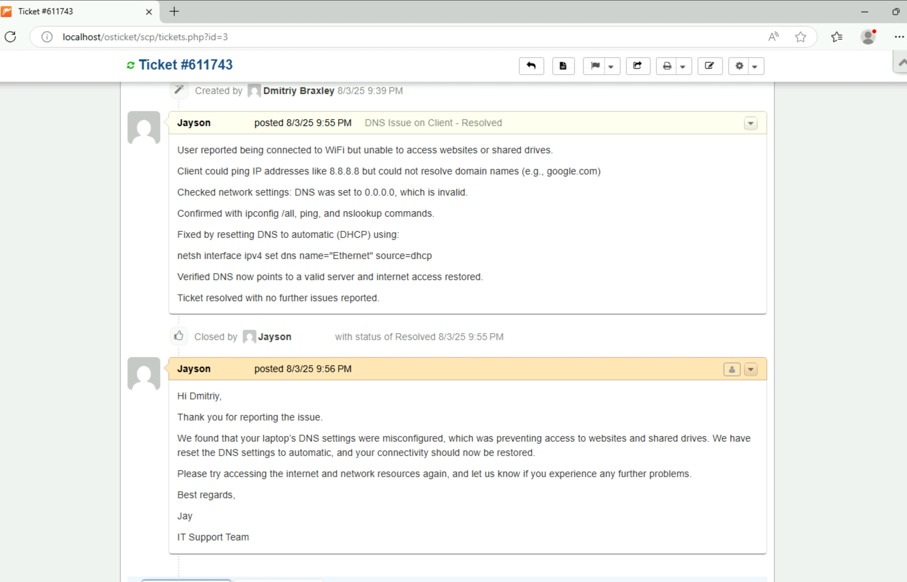

# OsTicket Desk Implementation & L1 Support

## Overview
This project demonstrates the full lifecycle of a scalable IT support system, from initial provisioning and configuration to real-world troubleshooting and documentation. It showcases my skills in system administration, database management, user support, and network diagnostics.

---

## Lab Guide

### **Part 1: System Provisioning**
The first phase involved building a functional web server environment from the ground up and deploying an enterprise-grade help desk solution.

#### **Step 1: Provisioning a Local Server Environment**

Provisioned a local server environment (WAMP Stack) to host web applications.

#### **Step 2: Database Creation**

Configured the MySQL database schema required for the osTicket application.

#### **Step 3: Application Deployment**

Deployed the osTicket application by linking it to the database and configuring administrator credentials.

#### **Step 4: Installation Complete**

Successfully completed the help desk installation and validated the operational readiness of the system.

### **Part 2: Demonstrating L1 Support Workflow**
This section highlights my ability to handle common user requests, from initial ticket intake to timely resolution and professional communication.

#### **Step 5: User Ticket Intake**

Initiated the standard support workflow by accepting a password reset request submitted by a user.

#### **Step 6: User Account Resolution**

Resolved the user's issue by unlocking the account through Active Directory, demonstrating familiarity with core sysadmin tools.

#### **Step 7: Professional Communication**

Communicated the resolution to the user and prepared to close the ticket in compliance with standard operating procedures.

#### **Step 8: Ticket Closure**

Achieved ticket closure, successfully resolving the user's request from start to finish.

### **Part 3: Advanced Network Diagnostics & Troubleshooting**
This phase demonstrates my ability to tackle more complex technical challenges using advanced command-line diagnostics and documentation.

#### **Step 9: Network Issue Report**

Opened a new ticket reporting a complex network connectivity issue.

#### **Step 10: Ping Diagnostics**

Performed an initial network diagnostic using the ping command, isolating the issue to a DNS problem rather than a total network failure.

#### **Step 11: DNS Problem Identification**

Used nslookup and ipconfig to confirm the root cause: a misconfigured DNS server.

#### **Step 12: Executing the Fix**

Executed a command to reset the network configuration, applying the technical fix.

#### **Step 13: Verifying Resolution**

Verified the successful fix by running a final ping test and confirming internet access in the browser.

#### **Step 14: Detailed Documentation**

Documented the full troubleshooting process within the ticket and closed it, completing the project.
